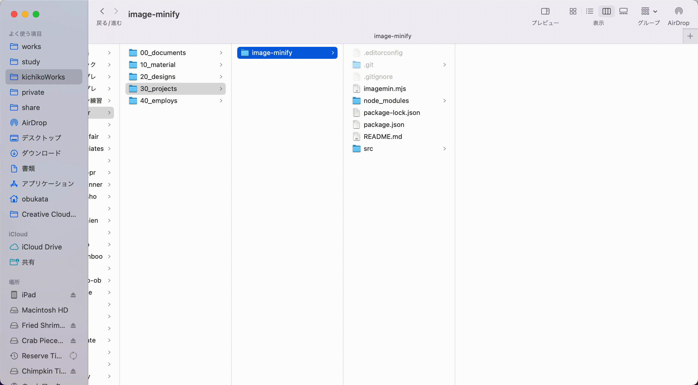

# Image minify

複数の画像を一定の圧縮率の元に軽量化する為のプロジェクト。

画像の縦横サイズをどうこうするものではないので
複数の画像サイズを変更したい場合は、Photoshopなどでバッチ処理をまず当てて下さい。



## ディレクトリ構成

```
root/
│
├─ src - サイズを軽量化したい変更したい画像を突っ込む。
└─ dist - 出力されるディレクトリ。
```

## npm

```
初回環境セットアップ時
$ npm install

画像出力
$ npm run build
```
